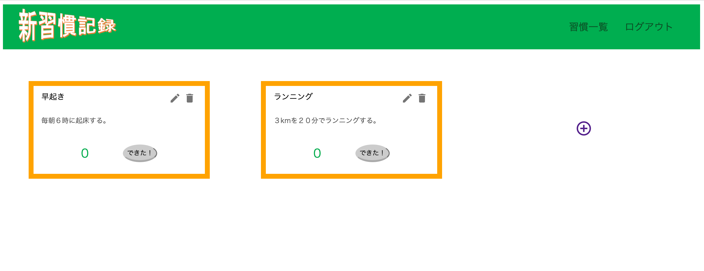
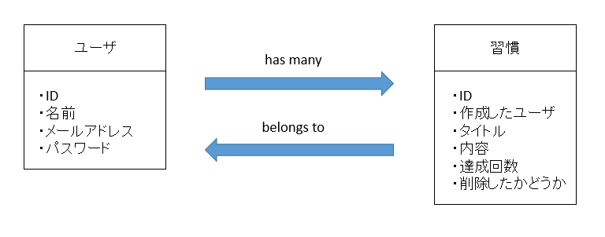
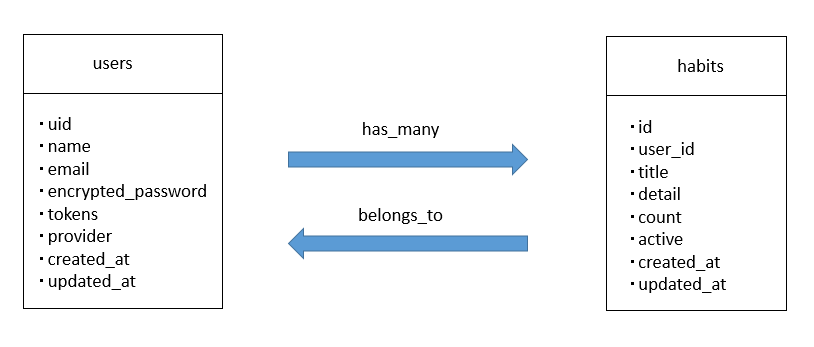

<h1>アプリ名</h1>
<h3>新習慣記録</h3>
 
 
<h1>なぜ作ったのか</h1>
<h3>早起きやランニング等の良い習慣を新しく取り入れて定着させることはとても難しいことです。そのため、難しい習慣化を少しでもサポートできればと思い作成しました。</h3>
 
 
<h1>デモ</h1>
<h3>まず、新しく習慣化したい事柄を登録します。その後は実施できた時にできたボタンを押し回数を増やしていきます。回数を記録することで達成感を感じ易くします。</h3>
 

 
 
<h1>ER図</h1>
<h3>必要なモデルとカラムは下図のようになりました。</h3>
 

 
 
<h3>実際に作成したモデル名とカラム名は下図のようにしました。</h3>
 

 
 
<h1>機能一覧</h1>
<ul>
  <li>一覧表示機能</li>
  <li>登録機能</li>
  <li>編集機能</li>
  <li>削除機能</li>
  <li>サインアップ機能</li>
  <li>ログイン機能</li>
  <li>ログアウト機能</li>
</ul>
 
 
<h1>こだわりポイント</h1>
<h3>railsのapiモードとreactを使用して作成した点です。</h3>
